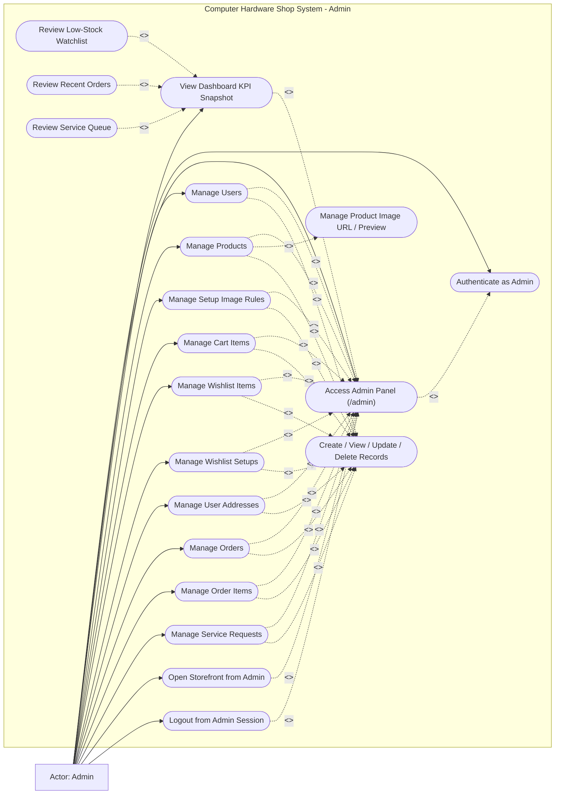

# Use Case Diagrams: Customer and Admin

## Customer Use Case Diagram

```mermaid
flowchart LR
    Customer["Actor: Customer"]

    subgraph CHS["Computer Hardware Shop System"]
        C_Register(["Register Account"])
        C_Authenticate(["Authenticate User (Login)"])
        C_Logout(["Logout"])
        C_ViewProfile(["View Profile"])
        C_ViewOrderDetail(["View Order Detail"])

        C_BrowseProducts(["Browse Product Catalog"])
        C_FilterSortProducts(["Filter and Sort Products"])
        C_SearchProducts(["Search Products"])
        C_GetProductSuggestions(["Get Product Suggestions (Autocomplete API)"])
        C_ViewProductDetail(["View Product Detail"])

        C_GetRecommendations(["Get Profile-Based Recommendations"])
        C_ViewPrebuilds(["View Recommended Prebuilds"])
        C_ViewPrebuildDetail(["View Prebuild Detail"])
        C_AddPrebuildToCart(["Add Prebuild Setup to Cart"])

        C_BuildCustomPC(["Build Custom PC"])
        C_EditCustomSetup(["Edit Existing Custom Setup"])
        C_SaveCustomSetupToCart(["Save Custom Setup to Cart"])

        C_AddToCart(["Add Product to Cart"])
        C_ViewCart(["View Cart"])
        C_ViewCartSetupDetail(["View Cart Setup Detail"])
        C_UpdateCartQty(["Update Cart Item Quantity"])
        C_RemoveSelectedCart(["Remove Selected Cart Items"])
        C_ClearCart(["Clear Cart"])

        C_ViewWishlist(["View Wishlist"])
        C_AddWishlistProduct(["Add Product to Wishlist"])
        C_AddWishlistSetup(["Add Prebuild Setup to Wishlist"])
        C_RemoveWishlistItems(["Remove Wishlist Items"])
        C_ClearWishlist(["Clear Wishlist"])
        C_MoveWishlistToCart(["Move Wishlist Item/Setup to Cart"])
        C_MoveCartToWishlist(["Move Cart Item to Wishlist"])

        C_ProceedPayment(["Proceed to Payment"])
        C_SelectCartItems(["Select Cart Items for Checkout"])
        C_ManageAddresses(["Manage and Select Delivery Address"])
        C_ChoosePaymentMode(["Choose Payment Mode"])
        C_PlaceOrder(["Place Order"])

        C_SubmitServiceRequest(["Submit Service Request"])
        C_SelectServiceAddress(["Select Home Visit Service Address"])
        C_PayServiceBooking(["Pay Service Booking Fee"])
        C_ReceiveServiceConfirmation(["Receive Service Confirmation"])
    end

    Customer --> C_Register
    Customer --> C_Authenticate
    Customer --> C_Logout
    Customer --> C_ViewProfile
    Customer --> C_ViewOrderDetail
    Customer --> C_BrowseProducts
    Customer --> C_SearchProducts
    Customer --> C_ViewProductDetail
    Customer --> C_GetRecommendations
    Customer --> C_ViewPrebuilds
    Customer --> C_ViewPrebuildDetail
    Customer --> C_AddPrebuildToCart
    Customer --> C_BuildCustomPC
    Customer --> C_EditCustomSetup
    Customer --> C_SaveCustomSetupToCart
    Customer --> C_AddToCart
    Customer --> C_ViewCart
    Customer --> C_ViewWishlist
    Customer --> C_ProceedPayment
    Customer --> C_PlaceOrder
    Customer --> C_SubmitServiceRequest
    Customer --> C_PayServiceBooking

    C_ViewProfile -. "<<include>>" .-> C_Authenticate
    C_ViewOrderDetail -. "<<include>>" .-> C_ViewProfile

    C_FilterSortProducts -. "<<extend>>" .-> C_BrowseProducts
    C_SearchProducts -. "<<include>>" .-> C_GetProductSuggestions
    C_ViewProductDetail -. "<<extend>>" .-> C_BrowseProducts

    C_GetRecommendations -. "<<include>>" .-> C_ViewPrebuilds
    C_ViewPrebuildDetail -. "<<extend>>" .-> C_ViewPrebuilds
    C_AddPrebuildToCart -. "<<include>>" .-> C_ViewPrebuildDetail

    C_EditCustomSetup -. "<<extend>>" .-> C_BuildCustomPC
    C_SaveCustomSetupToCart -. "<<include>>" .-> C_BuildCustomPC

    C_ViewCartSetupDetail -. "<<extend>>" .-> C_ViewCart
    C_UpdateCartQty -. "<<extend>>" .-> C_ViewCart
    C_RemoveSelectedCart -. "<<extend>>" .-> C_ViewCart
    C_ClearCart -. "<<extend>>" .-> C_ViewCart

    C_ViewWishlist -. "<<include>>" .-> C_Authenticate
    C_AddWishlistProduct -. "<<include>>" .-> C_Authenticate
    C_AddWishlistSetup -. "<<include>>" .-> C_Authenticate
    C_RemoveWishlistItems -. "<<include>>" .-> C_ViewWishlist
    C_ClearWishlist -. "<<include>>" .-> C_ViewWishlist
    C_MoveWishlistToCart -. "<<include>>" .-> C_ViewWishlist
    C_MoveCartToWishlist -. "<<include>>" .-> C_ViewCart
    C_MoveCartToWishlist -. "<<include>>" .-> C_Authenticate

    C_ProceedPayment -. "<<include>>" .-> C_Authenticate
    C_ProceedPayment -. "<<include>>" .-> C_ViewCart
    C_ProceedPayment -. "<<include>>" .-> C_SelectCartItems
    C_ProceedPayment -. "<<include>>" .-> C_ManageAddresses
    C_PlaceOrder -. "<<include>>" .-> C_ProceedPayment
    C_PlaceOrder -. "<<include>>" .-> C_ChoosePaymentMode

    C_SelectServiceAddress -. "<<extend>>" .-> C_SubmitServiceRequest
    C_PayServiceBooking -. "<<include>>" .-> C_Authenticate
    C_PayServiceBooking -. "<<include>>" .-> C_SubmitServiceRequest
    C_ReceiveServiceConfirmation -. "<<include>>" .-> C_PayServiceBooking
```

## Admin Use Case Diagram

```mermaid
flowchart LR
    Admin["Actor: Admin"]

    subgraph CHS_ADMIN["Computer Hardware Shop System - Admin"]
        A_AuthenticateAdmin(["Authenticate as Admin"])
        A_AccessAdminPanel(["Access Admin Panel (/admin)"])

        A_ViewDashboardKPIs(["View Dashboard KPI Snapshot"])
        A_ViewLowStock(["Review Low-Stock Watchlist"])
        A_ViewRecentOrders(["Review Recent Orders"])
        A_ViewServiceQueue(["Review Service Queue"])

        A_CRUDRecords(["Create / View / Update / Delete Records"])
        A_ManageUsers(["Manage Users"])
        A_ManageProducts(["Manage Products"])
        A_ManageProductImages(["Manage Product Image URL / Preview"])
        A_ManageSetupImageRules(["Manage Setup Image Rules"])
        A_ManageCartItems(["Manage Cart Items"])
        A_ManageWishlistItems(["Manage Wishlist Items"])
        A_ManageWishlistSetups(["Manage Wishlist Setups"])
        A_ManageUserAddresses(["Manage User Addresses"])
        A_ManageOrders(["Manage Orders"])
        A_ManageOrderItems(["Manage Order Items"])
        A_ManageServiceRequests(["Manage Service Requests"])

        A_OpenStorefront(["Open Storefront from Admin"])
        A_LogoutAdmin(["Logout from Admin Session"])
    end

    Admin --> A_AuthenticateAdmin
    Admin --> A_AccessAdminPanel
    Admin --> A_ViewDashboardKPIs
    Admin --> A_ManageUsers
    Admin --> A_ManageProducts
    Admin --> A_ManageSetupImageRules
    Admin --> A_ManageCartItems
    Admin --> A_ManageWishlistItems
    Admin --> A_ManageWishlistSetups
    Admin --> A_ManageUserAddresses
    Admin --> A_ManageOrders
    Admin --> A_ManageOrderItems
    Admin --> A_ManageServiceRequests
    Admin --> A_OpenStorefront
    Admin --> A_LogoutAdmin

    A_AccessAdminPanel -. "<<include>>" .-> A_AuthenticateAdmin
    A_ViewDashboardKPIs -. "<<include>>" .-> A_AccessAdminPanel
    A_ViewLowStock -. "<<extend>>" .-> A_ViewDashboardKPIs
    A_ViewRecentOrders -. "<<extend>>" .-> A_ViewDashboardKPIs
    A_ViewServiceQueue -. "<<extend>>" .-> A_ViewDashboardKPIs

    A_ManageUsers -. "<<include>>" .-> A_AccessAdminPanel
    A_ManageProducts -. "<<include>>" .-> A_AccessAdminPanel
    A_ManageProducts -. "<<include>>" .-> A_ManageProductImages
    A_ManageSetupImageRules -. "<<include>>" .-> A_AccessAdminPanel
    A_ManageCartItems -. "<<include>>" .-> A_AccessAdminPanel
    A_ManageWishlistItems -. "<<include>>" .-> A_AccessAdminPanel
    A_ManageWishlistSetups -. "<<include>>" .-> A_AccessAdminPanel
    A_ManageUserAddresses -. "<<include>>" .-> A_AccessAdminPanel
    A_ManageOrders -. "<<include>>" .-> A_AccessAdminPanel
    A_ManageOrderItems -. "<<include>>" .-> A_AccessAdminPanel
    A_ManageServiceRequests -. "<<include>>" .-> A_AccessAdminPanel

    A_ManageUsers -. "<<include>>" .-> A_CRUDRecords
    A_ManageProducts -. "<<include>>" .-> A_CRUDRecords
    A_ManageSetupImageRules -. "<<include>>" .-> A_CRUDRecords
    A_ManageCartItems -. "<<include>>" .-> A_CRUDRecords
    A_ManageWishlistItems -. "<<include>>" .-> A_CRUDRecords
    A_ManageWishlistSetups -. "<<include>>" .-> A_CRUDRecords
    A_ManageUserAddresses -. "<<include>>" .-> A_CRUDRecords
    A_ManageOrders -. "<<include>>" .-> A_CRUDRecords
    A_ManageOrderItems -. "<<include>>" .-> A_CRUDRecords
    A_ManageServiceRequests -. "<<include>>" .-> A_CRUDRecords

    A_OpenStorefront -. "<<extend>>" .-> A_AccessAdminPanel
    A_LogoutAdmin -. "<<include>>" .-> A_AccessAdminPanel
```
